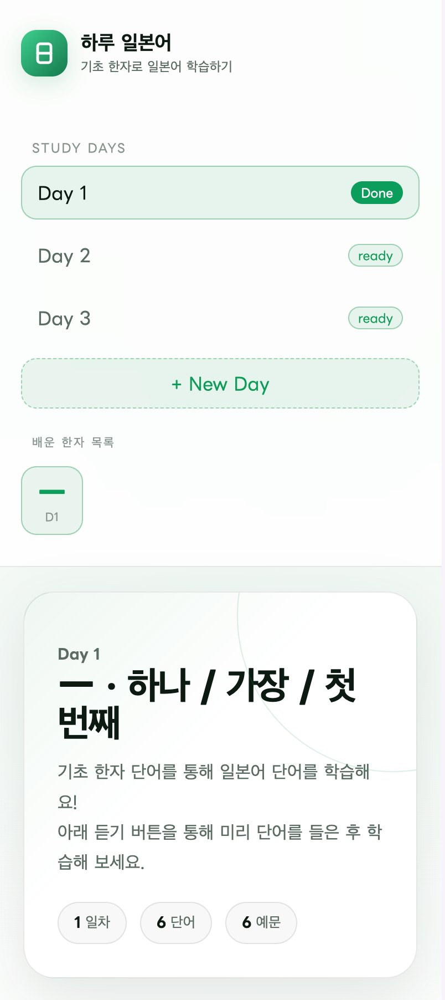
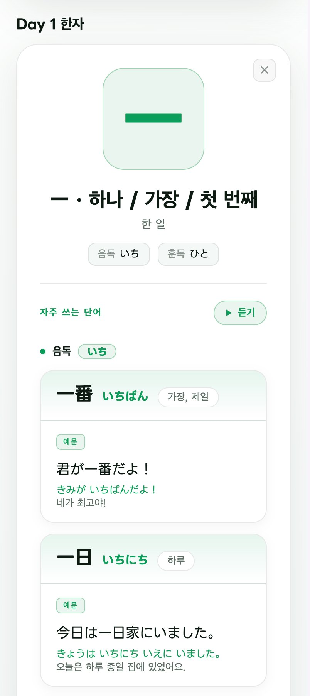
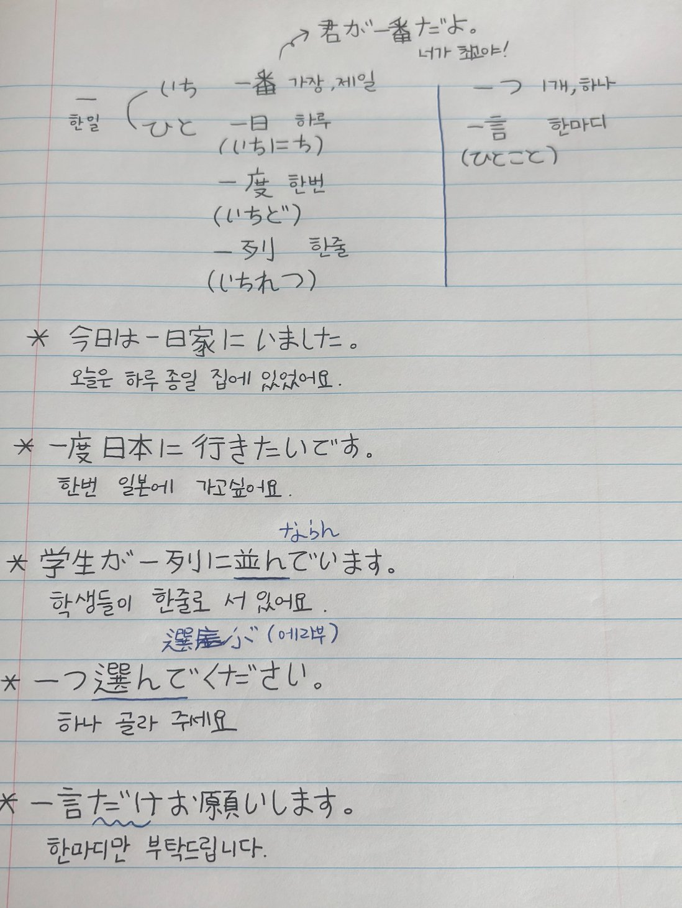

# Haru Japanese (하루 일본어)

Learn Japanese vocabulary through basic kanji, one kanji a day.

Each daily study page is built from my own handwritten study notes, then turned into a clean, reviewable web page with audio.

**Live demo:** https://itkoo.github.io/ja-study-app/

<br>

## Screenshots

<table>
  <tr>
    <td width="50%"></td>
    <td width="50%"></td>
  </tr>
  <tr>
    <td align="center">Home — study days &amp; learned kanji</td>
    <td align="center">Word cards grouped by reading</td>
  </tr>
</table>

<br>

## From handwritten notes

Every day's content starts as a handwritten note and becomes a structured study page. Below is the Day 1 note that the kanji 一 page is based on.



<br>

## Features

- **One kanji per day** — focus on a single kanji each day and build up your list over time.
- **On / Kun reading groups** — words are split into on-reading (e.g. いち) and kun-reading (e.g. ひと) so reading patterns are easy to learn.
- **Example per word** — every word shows a sentence right below it in three lines: Japanese, hiragana, and Korean.
- **Audio playback** — a "듣기" (Listen) button plays the word audio before you study.
- **Learned-kanji list** — past kanji stack in the sidebar; click one to jump to that day.
- **Auto-save** — progress is stored in the browser (localStorage) and kept across visits.

<br>

## Tech

- Plain HTML / CSS / JavaScript — no framework, no build step
- Font: LINE Seed JP
- Storage: browser localStorage
- Hosting: GitHub Pages

The whole app is a single `index.html` file with no server required.

<br>

## Run locally

```bash
git clone https://github.com/ITKOO/ja-study-app.git
cd ja-study-app
# open index.html in your browser
```

<br>

## Adding study data

Add a new day to the `SEED` data inside `index.html`:

```js
{
  day: 2,
  kanji: "二", title: "둘 / 두 번째", meaning: "두 이",
  onReading: "に", kunReading: "ふた",
  audio: "audio_url.mp3",            // optional
  onWords: [
    { w:"二月", r:"にがつ", m:"2월",
      ex:["二月は寒いです。", "にがつは さむいです。", "2월은 추워요."] }
  ],
  kunWords: [
    { w:"二つ", r:"ふたつ", m:"두 개",
      ex:["二つください。", "ふたつ ください。", "두 개 주세요."] }
  ]
}
```

- `onWords` / `kunWords`: word lists (`w` word, `r` reading, `m` meaning, `ex` example)
- `audio`: if present, the Listen button appears automatically

When the data structure changes, bump `STORE_KEY` to reset old localStorage data.

<br>

## Roadmap

- [ ] Per-day audio
- [ ] Cross-device sync (Supabase backend)
- [ ] PWA support (installable, offline)

<br>

## License

Personal learning project.
